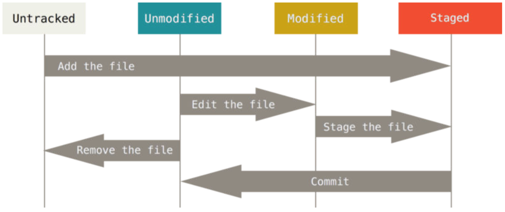

#Clase 2 Práctico DA2

##Temas
1. Git por consola
2. Github
3. Ejercicio github
4. Postman
5. Dudas

##Git por consola

###Intro GIT

###Comandos básicos

```bash
git init
git clone
git add
git status
git commit
git checkout
git merge
git remote
git fetch
git pull
git push
```

###Iniciando el repositorio
Hay dos maneras de utilizar Git en tus proyectos.

####```git init```

Esto permite seguir un proyecto existente en Git. Para ello, se debe acceder a la carpeta del proyecto, y correr el comando ```git init```.
Al ejecutar el comando, se crea un subdirectorio ```.git```, el que contendrá todos los archivos necesarios para mantener el repositorio. Luego de ejecutado este comando, ninguno de los archivos del proyecto se encuentran mantenidos por el repositorio.

####```git clone```

En caso de querer obtener un repositorio existente, se debe utilizar el siguiente comando.
```bash
git clone https://github.com/DisAplicaciones2ORT0316/Clase2.git
```

Al compararlo con otros sistemas de control de versiones, como Subversion, se puede apreciar la diferencia entre ```clone``` y ```checkout```. Esta diferencia es importante, ya que ```git clone``` trae una copia completa de casi toda la información almacenada en el repositorio. Esto quiere decir que, si el disco duro del servidor de repositorios se corrompe, cualquiera de los clones puede ser usado como respaldo para restaurarlo.

Este comando crea un directorio con el nomrbe del repositorio, y dentro de él coloca todos los archivos del mismo. En caso de querer personalizar el directorio que se va a crear, se agrega luego de la url del repositorio.

```bash
git clone https://github.com/DisAplicaciones2ORT0316/Clase2.git MiClase2
```

Los protocolos de transferencia de git pueden ser https, como el anterior, o con ssh, dependiendo de la preferencia del usuario.

###Guardando cambios en el repositorio

Luego de iniciado el repositorio, todos los archivos quedan en estado *Untracked*. Esto quiere decir que git no seguirá los cambios que se le realicen al archivo. A partir de ahora, comienza el siguiente ciclo:



####```git add```

Los cambios solo se enviarán al repositorio si están en el área *staged*. Para agregar los archivos, se debe ejecutar ```git add README.md```. De esta manera, ese archivo pasa del estado *untracked* al estado *staged*. Para agregar todos los archivos de nuestra ubicación, se puede utilizar ```git add . ```. 

####```git status```
Una vez que se comienza a trabajar con archivos, es común la necesidad de revisar el estado de los mismos. Para ello se debe utilizar el comando ```git status```.


A partir de este comando, se describen los archivos que se encuentran staged, modified y los que no se siguen aún. De esta manera es posible determinar que archivos serán incluídos en el próximo commit, y cuáles no.

####```git commit```
Para enviar los cambios al repositorio, se utiliza el comando ```git commit```. Este comando toma todos los archivos que se encuentran en estado *staged*, y agrega un nuevo snapshot de sus cambios en el repositorio local. Vale recordar que en git, a diferencia de repositorios centralizados, los repositorios son locales y se sincronizan con un repositorio remoto.

En caso de ejecutar el comando únicamente con ```git commit``` se abrirá el editor por defecto configurado en el ambiente. En este caso es Vim.


Para poder escribir el mensaje directamente al hacer el commit, utilizamos la opción ```-m```

```git commit -m "Este es el mensaje del commit"```

Es posible también unir el ```git add``` y el ```git commit``` en una sola sentencia, utilizando la opción ```-a``` de ```commit```.

```git commit -a -m "Este commit incluye todos los archivos que podían ser agregados"```

###Las branches de Git

Git permite utilizar diferentes branches para mantener distintas versiones del código en paralelo. El estándar que se utiliza en el curso es [gitflow](http://nvie.com/posts/a-successful-git-branching-model/).

####```git checkout```
Para cambiar el branch en la que se está trabajando, se utiliza el comando ```git checkout```.
Si se está trabajando en ```develop``` y se desea pasar a utilizar ```master```, se realiza el siguiente comando ```git checkout master```. 


Para crear una nueva branch, es necesario ubicarse en la branch padre, y realizar ```git checkout -b```. La opción ```-b``` permite crear una branch que se abre de la rama padre. Siguiendo ```gitflow```, si se desea crear una nueva feature, se utilizaría el siguiente comando.

```bash
git checkout develop #Selecciono la branch develop
git checkout -b feature/newfeature #Creo una nueva feature
```

####```git merge