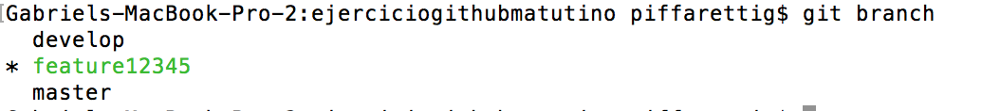
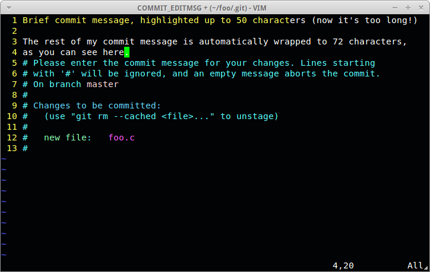

# Clase 2 DA2 Práctico: Repaso Git + Introducción a Web API 2
[Ver presentación de la clase](http://ORT-DA2.github.io/Clase-2/#/)  
[Descargar el pdf] (/Clase-2.pdf)

## Temas

<!-- MarkdownTOC -->

- Repaso de Git por consola
- Introducción a ASP.NET Web API 2
	- Ventajas de ASP.NET Web API
	- Características de ASP.NET Web API
	- Introducción a REST
	- Ejercicio:

<!-- /MarkdownTOC -->

#Repaso de Git por consola

###Comandos básicos

```bash
git init
git clone
git add
git status
git commit
git branch
git checkout
git merge
git remote
git fetch
git pull
git push
```

###¿Cómo puedo saber cuál es el comportamiento de cada comando, su uso y sus configuraciones adicionales?

La página por excelencia para leer sobre Git es: [git-scm](https://git-scm.com/docs)

###Iniciando el repositorio
Hay dos maneras de utilizar Git en tus proyectos.

####```git init```

Esto permite seguir un proyecto existente en Git. Para ello, se debe acceder a la carpeta del proyecto, y correr el comando ```git init```.
Al ejecutar el comando, se crea un subdirectorio ```.git```, el que contendrá todos los archivos necesarios para mantener el repositorio. Luego de ejecutado este comando, ninguno de los archivos del proyecto se encuentran mantenidos por el repositorio.

####```git clone```

En caso de querer obtener un repositorio existente, se debe utilizar el siguiente comando.
```bash
git clone https://github.com/DisAplicaciones2ORT0316/Clase2.git
```
Al compararlo con otros sistemas de control de versiones, como Subversion, se puede apreciar la diferencia entre ```clone``` y ```checkout```. Esta diferencia es importante, ya que ```git clone``` trae una copia completa de casi toda la información almacenada en el repositorio. Esto quiere decir que, si el disco duro del servidor de repositorios se corrompe, cualquiera de los clones puede ser usado como respaldo para restaurarlo.

Este comando crea un directorio con el nomrbe del repositorio, y dentro de él coloca todos los archivos del mismo. En caso de querer personalizar el directorio que se va a crear, se agrega luego de la url del repositorio.

```bash
git clone https://github.com/DisAplicaciones2ORT0316/Clase2.git MiClase2
```

Los protocolos de transferencia de git pueden ser https, como el anterior, o con ssh, dependiendo de la preferencia del usuario.

###Guardando cambios en el repositorio

Luego de iniciado el repositorio, todos los archivos quedan en estado *Untracked*. Esto quiere decir que git no seguirá los cambios que se le realicen al archivo. A partir de ahora, comienza el siguiente ciclo:


####```git add```

Los cambios solo se enviarán al repositorio si están en el área *staged*. Para agregar los archivos, se debe ejecutar ```git add README.md```. De esta manera, ese archivo pasa del estado *untracked* al estado *staged*. Para agregar todos los archivos de nuestra ubicación, se puede utilizar ```git add . ```. 

####```git status```
Una vez que se comienza a trabajar con archivos, es común la necesidad de revisar el estado de los mismos. Para ello se debe utilizar el comando ```git status```.


A partir de este comando, se describen los archivos que se encuentran staged, modified y los que no se siguen aún. De esta manera es posible determinar que archivos serán incluídos en el próximo commit, y cuáles no.

####```git commit```
Para enviar los cambios al repositorio, se utiliza el comando ```git commit```. Este comando toma todos los archivos que se encuentran en estado *staged*, y agrega un nuevo snapshot de sus cambios en el repositorio local. Vale recordar que en git, a diferencia de repositorios centralizados, los repositorios son locales y se sincronizan con un repositorio remoto.


En caso de ejecutar el comando únicamente con ```git commit``` se abrirá el editor por defecto configurado en el ambiente. En este caso es Vim. (VER: Guardando resultado de merging con Vim, más abajo).

Para poder escribir el mensaje directamente al hacer el commit, utilizamos la opción ```-m```

```git commit -m "Este es el mensaje del commit"```

Es posible también unir el ```git add``` y el ```git commit``` en una sola sentencia, utilizando la opción ```-a``` de ```commit```.

```git commit -a -m "Este commit incluye todos los archivos que podían ser agregados"```

###Las branches de Git

Git permite utilizar diferentes branches para mantener distintas versiones del código en paralelo. El estándar que se utiliza en el curso es [gitflow](http://nvie.com/posts/a-successful-git-branching-model/).

####```git branch```

Permite listar, crear, o eliminar ramas.

Si usamos simplemente ```git branch``` o ```git branch --list``` se listan las ramas existentes, marcando la rama actual con un asterisco.



También podemos crear una nueva rama:

```git branch nuevaRama```

O eliminarla:

```git branch -d nuevaRama```

Para crear una rama y moverme a ella:

```git branch nuevaRama```  
```git checkout nuevaRama```

Estos dos comandos anteriores puede ser resumidos usando simplemente ```git checkout -b nuevaRama```.  

Esto se verá en la siguiente sección (git checkout).

####```git checkout```
Para cambiar el branch en la que se está trabajando, se utiliza el comando ```git checkout```.
Si se está trabajando en ```develop``` y se desea pasar a utilizar ```master```, se realiza el siguiente comando ```git checkout master```. 

Para crear una nueva branch, es necesario ubicarse en la branch padre, y realizar ```git checkout -b```. La opción ```-b``` permite crear una branch que se abre de la rama padre. Siguiendo ```gitflow```, si se desea crear una nueva feature, se utilizaría el siguiente comando.

```bash
git checkout develop #Selecciono la branch develop
git checkout -b feature/newfeature #Creo una nueva feature
```

####```git merge``` 

Una vez terminada una feature, se debe unir el contenido en dicha rama con el que se encuentra en develop. Para ello se utiliza ```git merge```.
Supongamos que se termina de trabajar en la branch feature/newfeature y se desea unirla a develop. Luego de enviar todos los cambios al repositorio (commit), se debe ejecutar lo siguiente:

```bash
git checkout develop
git merge feature/newfeature
```
Una vez realizado el merge, git intenta enviar los cambios al repositorio. En caso que existan conflictos, este proceso falla y se deben resolver. Los archivos en los que haya conflictos se detallarán en el mensaje luego del merge, y se deberán resolver uno a uno. Si se abre uno de los archivos en conflicto, por ejemplo un html, se puede encontrar algo similar a lo siguiente.

```html

<<<<<<< HEAD:index.html
<div id="footer">contact : email.support@github.com</div>
=======
<div id="footer">
please contact us at support@github.com
</div>
>>>>>>> feature/newfeature:index.html

```

#### Guardando resultado de merging con Vim



Para guardar en vim deberíamos estar en el modo de comandos, esto lo hacemos apretando ```Esc``` 

Una vez agregado nuestro mensaje al commit, podemos usar ```w``` (write) para guardar y ```q``` (quit) para salir, pero en Vim primero debemos escribir ```:```. Por ende la sentencia entera sería:

```:wq```  (lo cual equivale a  hacer un write + quit por separado)

También, es lo mismo poner: ```:x``` (es una forma resumida para lo anterior)

Si quisieramos elegir otro editor en lugar de Vim, como por ejemplo nano:

```git config core.editor "nano"```

####```git remote```
Este comando permite gestionar los repositorios remotos. En caso de que hayamos inicializado el repositorio con ```git init``` también podemos usarlo para agregar un servidor de repositorio.

```git remote add origin https://github.com/DisAplicaciones2ORT0316/Clase2.git```

####```git fetch```
En caso de tener branches remotas, este comando permite traer toda la información de un repositorio remoto que no se tenga en el repositorio local. Por ejemplo: Si un compañero realiza un cambio en su repositorio local, y envía estos datos al repositorio remoto, el otro compañero puede utilizar este comando para visualizar los cambios, sin necesidad de sumarlos a su branch local.

Se utiliza de la siguiente manera.

```git fetch origin```

También se puede hacer con una única rama.

```git fetch origin develop```

####```git pull```

En caso de setear un branch local para que siga a una branch remota, utilizar este comando permite hacer un ```fetch``` y luego un ```merge``` de la rama remota con la rama local.

####```git push```

Este último comando lo que realiza es enviar todos los commits realizados en el repositorio local al repositorio remoto.
```git remote push origin develop```

# Introducción a ASP.NET Web API 2

### ASP.NET como un Framework de Servicios

Desde el primer lanzamiento de .NET en 2002, MS proveyó varios caminos para construir aplicaciones orientadas a servicios. En primer lugar aparecieron los servicios web de ASP.NET basados en ASMX (mensajes por XML) que implementaban SOAP y estaban disponibles únicamente a través de HTTP. Con la versión 1.0 del framework apareció Remoting, permitiendo a los desarrolladores escribir servicios no atados a HTTP. Hace 10 años, con el lanzamiento de la versión 3.0 de .NET, llegó WCF. Este framework trajo consigo un salto gigantesco en flexibilidad, configurabilidad y extensibilidad, al mismo tiempo que soportaba estándares de seguridad más modernos.
Si tu objetivo es construir la comunicación entre dos aplicaciones, seguro que WCF puede hacerlo. Y si no lo logra con lo que trae desde la caja, su modelo de extensibilidad permitirá agregar cualquier cosa que desees.

### En la tierra de JavaScript y Dispositivos Móviles

Aunque durante la mayor parte de las últimas 3 décadas, los sitios web dependían de código del lado del servidor para cualquier cosa además de la manipulación de HTML, la llegada de JavaScript y Ajax han generado algunos cambios. Estas últimas generaron la necesidad de servicios que sean menos acerca de aplicaciones complejas comunicándose entre si y más acerca de páginas web necesitando obtener y enviar pequeñas cantidades de datos. Un ejemplo de este tipo de aplicaciones son las SPA (Single Page Applicactions). Podemos considerarlas como clientes "gordas" que corren en los navegadores web, con JavaScript conectando desde el navegador al *back-end*. Ya que los sitios web son aplicaciones HTTP, comunicarse utilizando este protocolo es un hecho. Además, el uso del navegador web permite requerimientos de seguridad más simples. Lo que es más, las páginas web típicamente se comunican utilizando mensajes basados en texto, en lugar de mensajes binarios. JSON o XML serán más que suficientes para ellas. 
Por otro lado, las aplicaciones móviles también se comportan de manera similar a las aplicaciones web. Se comunican a través de HTTP, envían y reciben pequeñas cantidades de datos basados en texto, y sus modelos de seguridad se mantienen minimalistas para favorecer la experiencia de usuario.
Tomando todo esto en cuenta, aparece entonces una creciente demanda para un framework de servicios que provea exactamente lo necesario para estos simples servicios HTTP. Si bien WCF puede lograr todo esto, definitivamente no está configurado de esta manera por defecto, y su flexibilidad genera que sea demasiado fácil errarle en alguna parte. Es aquí que entra Web API

## Ventajas de ASP.NET Web API

- **Configuración**
No existe mucha configuración necesaria para levantar un servicio de ASP.NET Web API. No hay endpoints ni contratos, y los servicios son bastante *holgados* en comparación con un servicio de WCF. Solo es necesaria una url REST, un conjunto de argumentos entrantes y un mensaje de respuesta.

- **REST por defecto**
Principalmente debido a la funcionalidad de ruteo provista por el framework, provee casi todo para una arquitectura REST. Las direcciones de los servicios son rutas RESTful que se mapean con los métodos de los controladores, lo que se presta para realizar APIs REST.

A continuación se muestra un ejemplo de una especificación de un servicio utilizando Web API. En ella, especificamos el código necesario para obtener una única tarea. Este método toma el id de una tarea y retorna la tarea correspondiente.

```C#

public class TasksController : ApiController
{

	private readonly IRepository _repository;

	public TasksController(IRepository repository)
	{
		_repository = repository;
	}

	public Task Get(long taskId)
	{
		return Json(_repository.Get<Task>(taskId));
	}
}

```

La clase base  ```ApiController``` fue construida específicamente para permitir servicios RESTful. En el método, simplemente se retorna el objeto, o la colección de los mismos, que se hayan solicitado. La URL para obtener este servicio sería la siguiente

`http://localhost:80/tasks/{TaskId}`

Presta atención a que la URL no necesita incluir el nombre del método del controlador, ya que el framework mapea los verbos HTTP automáticamente a los métodos del controlador, lo que ayuda a construir APIs que se apeguen más a la arquitectura REST.

- **Abstracciones con rutas**

De manera similar a como las interfaces de servicio y sus implementaciones en WCF, las rutas permiten al desarrollador de Web API tener una capa de abstracción entre lo que el cliente ve y la implementación subyacente. Como la firma de la API no está atada a una interfaz, clase o archivo particular, el desarrollador es libre de intercambiar la implementación del método siempre y cuando la uri siga siendo válida.

- **Controller Activation**
En cualquier framework que permite el desarrollo de aplicaciones orientadas a servicios, existe el concepto de *service activation*. En WCF o ASP.NET, cada llamada a un servicio es un nuevo pedido, por lo que el ambiente de ejecución activa una nueva instancia del servicio para cada una. Esto es similar a la instanciación de objetos en OO.

- **Interoperabilidad con JSON, XML y REST**
Ya que REST está basado únicamente sobre estándares HTTP, es interoperable con cualquier plataforma capaz de realizar pedidos HTTP. Lo mismo aplica para JSON y XML. Si bien SOAP es un protocolo basado en XML, construir un mensaje SOAP válido es bastante más complejo que simplemente representar la información en un XML. Lo mismo puede decirse de parsear JSON o XML vs mensajes SOAP.


## Características de ASP.NET Web API

- **Acciones CRUD basadas en convención**
Los verbos HTTP son mapeados automáticamente a los métodos de los controladores según sus nombres. Por ejemplo: si el controller se llama Products, un pedido GET a ```/api/products``` invocará automáticamente un método llamado Get en el controlador.

- **Negociación de Contenido incluída**
En este framework, solo alcanza con retornar el tipo de datos crudo, y él se encarga de transformarlo en JSON o XML. Solo es necesario que el cliente utilice un encabezado HTTP Accept o Content-Type para especificar el tipo de contenido deseado para retornar los datos.

- **Ruteo por atributo y prefijos de ruta**
A veces no es deseable seguir ruteos basados en convenciones. En esta nueva versión, es posible utilizar Route, RoutePrefix, y varios atributos Http* para definir rutas explícitamente, lo uqe permite mejorar la manera de manejar las relaciones entre recursos.

- **Restricciones en rutas**
Esto permite incluir las restricciones de los métodos de controllers a reglas de negocio. Por ejemplo, además de {id}, ahora es posible incluir ```{id:int}```, ```{id:min(10)}```, ```{id:range(1,100)}```, o ```{tel:regex(^\d{3}-\d{3}-\d{3})}```

- **Soporte de CORS**
El atributo ```EnableCors``` permite al desarrolador de la API permitir pedidos *cross-origin* de aplicaciones JavaScript de otros dominios.

- **Manejo global de errores**
Todas las excepciones no manejadas ahora pueden capturarse y manejarse desde un mecanismo central. El framework soporta múltiples loggers que tienen acceso a la excepción y el contexto en el que ocurrió.

- **```IHttpActionResult```**
Esta fábrica de la interface ```HttpResponseMessage``` provee una manera reusable y test-friendly de encapsular los resultados de los métodos de acción de la Web API. La respuesta creada fluye a través de un proceso de mensajes salientes, por lo que la negociación de contenido es respetada.

## Introducción a REST

Creada por Roy Fielding, REST intenta sacar una mayor ventaja de los estándares y tecnologías dentro de HTTP que lo que SOAP logra hoy en día. Por ejemplo, se insta a los desarrolladores a utilizar los verbos HTTP:
	- GET
	- POST
	- PUT
	- DELETE

REST es también centrada en los recursos. Esto quiere decir que las APIs REST utilizan verbos HTTP para actuar sobre u obtener información de recursos. A estos recursos se los conoce como sustantivos. Por lo tanto, obtenemos verbos actuando sobre sustantivos, o realizando acciones sobre recursos.

Además, REST aprovecha mejor otros aspectos de HTTP: 
	- Caching
	- Seguridad
	- Statelessness
	- Capas Web

Para seguir leyendo sobre REST, pueden leer el capítulo 5 de la [tesis doctoral de Fielding](http://www.ics.uci.edu/~fielding/pubs/dissertation/rest_arch_style.htm)

### ¿Qué es RESTful?

- Modelo de madurez de REST
- Trabajando con URIs y recursos
- Trabajando con verbos HTTP
- Códigos HTTP

### URIs y Recursos
Cómo ya establecimos, crear una interfaz RESTful significa terminar con una API céntrica al recurso. Por esto, se debe diseñar la interfaz con los recursos en el centro.
La acciones disponibles para esos recursos están restringidas por el uso de HTTP. Por lo tanto, es necesario mapear los verbos HTTP a la API, y no agregar otras acciones o verbos.

Tenemos dos tipos de URIs: Uris de colección y URIs individuales. Siguiendo con el ejemplo de las tareas, la URI de colección sería ```/api/tasks```, mientras que la URI individual sería ```/api/tasks/1234```. La sección de /api es la ruta para acceder a la api de la aplicación. tasks es la uri al recurso de Tareas, y si se coloca un id (en este caso 1234), se accede al recurso con ese id.

### Verbos HTTP
A continuación, estudiaremos los verbos HTTP disponibles para el desarrollo de nuestras APIs REST.

- GET
- PUT
- POST
- DELETE

Desde el punto de vista técnico, el estilo REST es agnóstico de un protocolo específico, incluido HTTP. En otras palabras, solo se necesito un protocolo que proveea un lenguaje y mecanismo para describir tanto estados (representaciones) y cambios de estado. Ya que estamos estudiando ASP.NET Web API, nos enfocaremos en REST sobre HTTP.

Analicemos algunos puntos importantes del mapeo. En primer lugar, el significado de cada uno de los 4 verbos depende de la URI. Dependiendo de si la URI apunta a un único elemento o a una colección, podemos tener hasta 8 acciones.
En segundo lugar, al crear nuevas instancias de un recurso, se utiliza el verbo PUT en caso de que quien realice el pedido ya haya generado el identificador del recurso previamente. En caso que la responsabilidad de crear el identificador recaiga sobre el sistema, se utiliza el verbo POST y la URI de colección. Esto está atado al concepto de *idempotencia*.

Se dice que los verbos GET, PUT y DELETE son *idempotentes*, ya que no importa cuantas veces se ejecute el pedido el resultado será siempre el mismo. Por ejemplo, si el cliente envía un pedido DELETE sobre un recurso, aunque el recurso ya haya sido borrado, no debería recibir errores. Es importante mantener la idempotencia de los GET, PUT y DELETE consistente. 

A diferencia de las otras, POST no es considerada Idempotente. Esto se debe a que este verbo se utiliza para crear una nueva instancia de un recurso por cada invocación del método.

Siguiendo con el ejemplo de las tareas:

| Método | URI | Verbo HTTP | Contrato/Cambio de estado |
|--------|-----|:----------:|---------------------------|
| CreateTask | /api/tasks | POST | HTTP POST usado para creación de Tarea |
| GetTask | /api/tasks/1234 | GET | HTTP GET usado para obtener una Tarea |
| GetTaskAsignees | /api/tasks/1234/users | GET | HTTP GET usado para obtener los usuarios asignados a una tarea |
| SearchTasks | /api/tasks | GET | HTTP GET usado para obtener una lista de tareas |
| UpdateTask | /api/tasks/1234 | PUT | HTTP PUT usado para modificar la Tarea |
| CompleteTask | /api/tasks/1234 | DELETE | HTTP DELETE usado para eliminar la Tarea |

### Códigos de estado HTTP

Además de estar restringidos por los HTTP para las acciones que podemos invocar, nuestras aplicaciones deben responder únicamente códigos conocidos HTTP. Es posible enviar más información, pero utilizarlos ayuda a la interoperabilidad de nuestra aplicación.

A continuación se presentan algunos de los estados disponibles. Para ver la lista completa, pueden acceder [aquí](www.w3.org/Protocols/rfc2616/rfc2616-sec10.html).

| **Status Code** | **Significado** |
|-----------------|-----------------|
|       200       | All is good; response will include applicable resource information, as well |
|       201       | Resource created; will include the Location header specifying a URI to the newly created resource |
|       202       | Same as 200, but used for async; in other words, all is good, but we need to poll the service to find out when completed |
|       301       | The resource was moved; should include URI to new location |
|       400       | Bad request; caller should reformat the request |
|       401       | Unauthorized; should respond with an authentication challenge, to let the caller resubmit with appropriate credentials |
|       402       | Reserved for future use, but many times used to indicate a failure in a business rule or validation check |
|       403       | Access denied; user successfully authenticated, but is not allowed to access the requested resource  |
|       404       | Resource not found, or caller not allowed to access the resource, and we don’t want to reveal the reason |
|       409       | Conflict; used as a response to a PUT request when another caller has dirtied the resource |
|       500       | Server error; something bad happened, and server might include some indication of the underlying problem |

### Patrón MVC

Este es un patrón que permite la separación de responsabilidades entre los elementos de una estructura de software. Establece que se contará con tres categorías de elementos:
- Modelo: Representado por las clases de dominio, las entidades.
- Vistas: La representación del modelo.
- Controlador: El nexo entre ambas.

## Ejercicio:

A continuación comenzaremos a desarrollar la primera aplicación, aprendiendo más sobre el framework sobre la marcha.
Pueden encontrar el ejercicio y las instrucciones [aquí](https://github.com/ORT-DA2/Clase-2/blob/master/Tresana.md)
