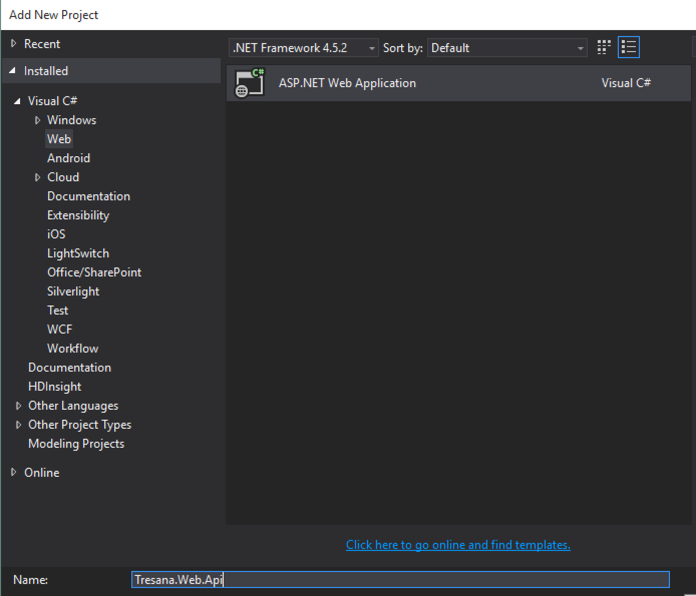
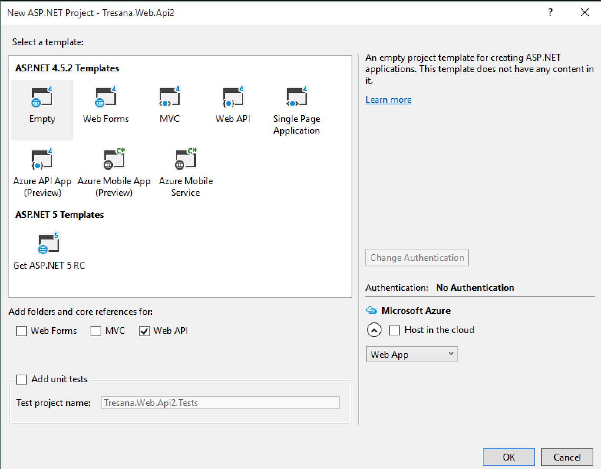
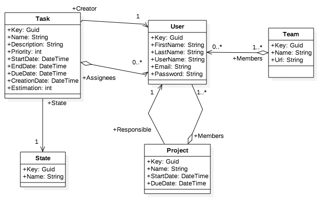
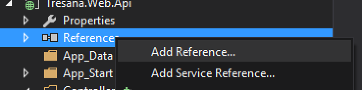

#Tresana

Tresana es una herramienta que permite a un equipo gestionar sus tareas siguiendo la metodología Scrum.

Cada tarea pertenece a un proyecto, y puede tener una lista de subtareas. Además, se le pueden agregar etiquetas que permitan facilicitar su organización.

Cada tarea se encuentra en un estado: Todo, In Progress, Freezer, Done.

Las tareas pueden estar asignadas a más de un usuario, aunque solo uno es el responsable de que se cumpla. Se pueden realizar comentarios sobre las tareas en una conversación interna, para poder documentar las decisiones tomadas con respecto a cada una.


## Comienzo del desarrollo de Tresana

A lo largo del curso, utilizaremos el desarrollo de un producto como ejemplo para navegar entre las tecnologías correspondientes.
Desarrollaremos Tresana, un gestor de tareas para equipos.

Para el desarrollo de hoy deberemos contar con las siguientes herramientas:
 - Visual Studio 2015 Enterprise
 - SQL Server 2012 Developer Edition
 - Cliente Postman

### Creando la estructura del proyecto

Para el desarrollo de la aplicación, deberá crearse una solución Tresana en Visual Studio con los siguientes proyectos:
 - Tresana.Web.Api: ASP.NET Web Application, con el formato vacío, importando Web API únicamente (como se muestra en las imágenes debajo)
 - Tresana.Web.Api.Models: Class Library
 - Tresana.Data.Entities: Class Library
 - Tresana.Data.DataAccess: Class Library




Tresana.Data.Entities será el proyecto en el que colocaremos nuestras entidades. Tresana.Data.DataAccess será el que contenga el contexto para EntityFramework. Tresana.Web.Api contendrá los servicios que expondremos a través de nuestra API REST, y Tresana.Web.Api.Models incluirá los modelos de las entidades. Esto último se debe a que no queremos acoplar nuestra api a nuestro modelo de dominio, por lo que generaremos lo que se conoce como DTO (DataTransferObjects). Estos objetos permitirán enviar únicamente los datos que deseo, además de moldearse mejor a las necesidades de la api rest, sin las restricciones de EntityFramework.

### Agregando nuestro dominio
En el proyecto Tresana.Data.Entities, cree las entidades reflejadas en el siguiente diagrama.



A continuación, debemos agregar EntityFramework al proyecto de DataAccess. Una vez agregado, debemos crear la clase TresanaContext en DataAccess, y agregarle una referencia al proyecto de Tresana.Data.Entities para poder utilizar las entidades.

```C#

using Tresana.Data.Entities;
using System.Data.Entity;

namespace Tresana.Data.DataAccess
{
    public class TresanaContext : DbContext
    {
        public DbSet<User> Users { get; set; }
        public DbSet<Task> Tasks { get; set; }
        public DbSet<Project> Projects { get; set; }
        public DbSet<State> States { get; set; }
        public DbSet<Team> Teams { get; set; }
    }
}
```



### Creando el primer Controller - Usuario

Antes de crear el controlador, debemos diseñar la api que vamos a exponer, dada la clase que queremos exponer. En primer lugar debemos pensar las acciones que efectuaremos sobre los usuarios: 
- Obtener una lista
- Obtener uno en particular
- Crear uno
- Actualizar sus datos
- Borrar un usuario

|     URI     | Verbo | Descripción |
|-------------|-------|-------------|
|/api/users   | GET   |Obtener una lista de todos usuarios|
|/api/users   | POST  |Crear un usuario|
|/api/users/1 | GET   |Obtener los datos del usuario 1|
|/api/users/1 | PUT   |Actualizar los datos del usuario 1|
|/api/users/1 | DELETE|Eliminar el usuario 1|

Teniendo entonces las uris definidas, debemos crear una clase que nos permita exponer estos métodos. Para ello, debemos crear un controlador. Un _controlador_ es un objeto que maneja los pedidos HTTP. 
Para crear el primer controlodor, debemos seleccionar nuestro proyecto de Web API, y seleccionar con el botón derecho la carpeta Controllers. Allí seleccionamos la opción de Agregar Item > Controller. Esto abrirá el diálogo para la creación de un controller. Seleccionamos la opción de crear un controlador vacío y el nombre sera UsersController.

Se creará la siguiente clase:

```C#
using System.Web.Http;

namespace Tresana.Web.Api.Controllers
{
    public class UsersController : ApiController
    {
        
    }
}
```

En Web Api, los controladores heredan de una clase llamada ApiController. En MVC, heredan de la clase Controller.

Los controladores en ASP.NET Web API retornan lo que se conoce como Action Results. 
Una acción de un controlador puede retornar cualquiera de las siguientes opciones:
1. ```void```
2. ```HttpResponseMessage```
3. ```IHttpActionResult```
4. Cualquier otro tipo.

Dependiendo el retorno, el framework utiliza un mecanismo diferente para crear la respuesta HTTP.

| Tipo de retorno | Mecanismo de creación de la respuesta |
|-----------------|---------------------------------------|
| ```void``` | Retorna código 204 (Sin Contenido) |
| ```HttpResponseMessage``` | Convierte directamente a un mensaje de respuesta HTTP |
| ```IHttpActionResult``` | Llama a ```ExecuteAsync``` para crear la ```HttpResponseMessage```, y luego convertirlo en el mensaje de respuesta HTTP |
| Cualquier otro tipo. | Escribe el valor de retorno serializado dentro de una respuesta 200 (OK) |


En todos los casos, el framework utiliza formateadores para serializar el valor de retorno. Dependiendo del header Accept de la solicitud, será el formato en que retorne. (JSON, XML, etc.)

Estudiaremos las opciones 2 y 3.

####```HttpResponseMessage```
Esta opción brinda mucho control sobre el mensaje de respuesta, permitiendo ingresar headers particulares, o modificar el formato del contenido.

Por ejemplo, si queremos controlar el header de cache, para devolver los usuarios, el método sería:

```C#

public HttpResponseMessage Get()
{

    using(TresanaContext ctx = new TresanaContext()){
        
        IEnumerable<User> users = ctx.Users.ToList();
        HttpResponseMessage response = Request.CreateResponse(HttpStatusCode.OK, users);
        response.Headers.CacheControl = new CacheControlHeaderValue()
            {
                MaxAge = TimeSpan.FromMinutes(20)
            };
    }
    return response;
}
```

####```IHttpActionResult```

Con esta opción, obtenemos una mayor flexibilidad a la hora de realizar los mensajes de respuesta. En general usaremos las implementaciones de esta clase disponibles en [System.Web.Http.Results](https://msdn.microsoft.com/en-us/library/system.web.http.results.aspx). La clase ```ApiController``` define métodos uqe permiten retornar estos resultados. Para retornar algo similar a lo visto con ```HttpResponseMessage```, el código quedaría de la siguiente manera.

```C#

public IHttpActionResult Get()
{

    IEnumerable<User> users;
    using(TresanaContext ctx = new TresanaContext())
    {

        users = ctx.Users.ToList();
    }
    
    if(users == null)
    {
        return NotFound();
    }
    return Ok(users);
}
```

En caso de desearlo, es posible implementar la interfaz para obtener mensajes de respuestas personalizados. En caso de desearlo, deberán investigar por su cuenta cómo realizarlo.

###Ruteo por atributos

_Routing_ es la manera en que Web API conecta una URI a una acción de un controlador. En Web API 2 se introduce lo que se conoce como _attribute routing_ que, como indica su nombre, utiliza los atributos para definir rutas. Esto brinda más control sobre las URIs. 
En la primer versión del framework, se utilizaba lo que se conoce como _convention routing_. Para utilizarlo, se definían templates de rutas (strings parametrizados), y luego el framework emparejaba una uri con el tamplate para decidir qué acción ejecutar. Sin embargo, este tipo de routing dificultaba utilizar algunos patrones comunes en APIs REST, como objetos con relaciones. Ej: Las tareas de un usuario.

Para activar _Attribute Routing_, hay que llamar a MapHttpAttributeRoutes durante la configuración de la aplicación. Para ello, modificamos el WebApiConfig, de la siguiente manera:

```C#

using System.Web.Http;

namespace WebApplication
{
    public static class WebApiConfig
    {
        public static void Register(HttpConfiguration config)
        {
            // Web API routes
            config.MapHttpAttributeRoutes();

            // Other Web API configuration not shown.
        }
    }
}

```

Podemos mantener las rutas por convención si así lo deseamos, quedando:

```C#

using System.Web.Http;

namespace WebApplication
{
    public static class WebApiConfig
    {
        public static void Register(HttpConfiguration config)
        {
            // Web API routes
            config.MapHttpAttributeRoutes();

            // Convention-based routing.
            config.Routes.MapHttpRoute(
                name: "DefaultApi",
                routeTemplate: "api/{controller}/{id}",
                defaults: new { id = RouteParameter.Optional }
            );
        }
    }
}

```

#### Agregando atributos de ruta

Veamos un ejemplo de una ruta definida usando un atributo


```C#

public class UsersController : ApiController
{

    [Route("users/{userId}")]
    [HttpGet]
    public User FindUserById(long userId)
    {
        //Código para obtener el usuario.
    }
}

```

El string definido luego de la etiqueta Route es el template de URI para la ruta. 
Al recibir un request, Web API intenta igualar la URI entrante con el template. En este caso, "users" es un segmento literal, y "{userId}" es un parámetro variable.

Para poder restringir lo que se pasa en los parámetros, se usan las **restricciones**, las cuales veremos más adelante.

#### Métodos HTTP disponibles

```C#
[HttpDelete]
[HttpGet]
[HttpHead]
[HttpOptions]
[HttpPatch]
[HttpPost]
[HttpPut]

```

Cree la funcionalidad necesaria para soportar métodos especificados.

### Probando la aplicación con POSTMAN

Acceder a [postman](https://www.getpostman.com/) y probar las funcionalidades creadas.

### Moviendo la lógica a servicios
Tener los métodos con lógica dentro de los controladores no parece la mejor opción. Además, nuestra api depende del paquete de Entities, algo que nos propusimos evitar desde el principio. Para lograrlo, crearemos un nuevo proyecto: Tresana.Web.Services.
En el proyecto de Services, incluiremos una referencia a Entities y a DataAccess, y serán los encargados de manejar la lógica de negocio de nuestra aplicación.

####Ejercicio:

Mueva la lógica de las acciones del controller de usuarios a un UserService.
